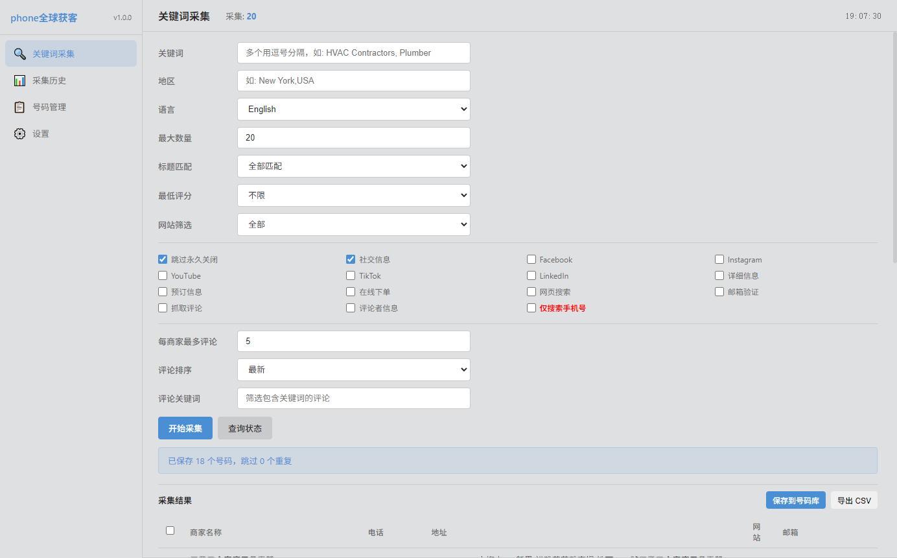
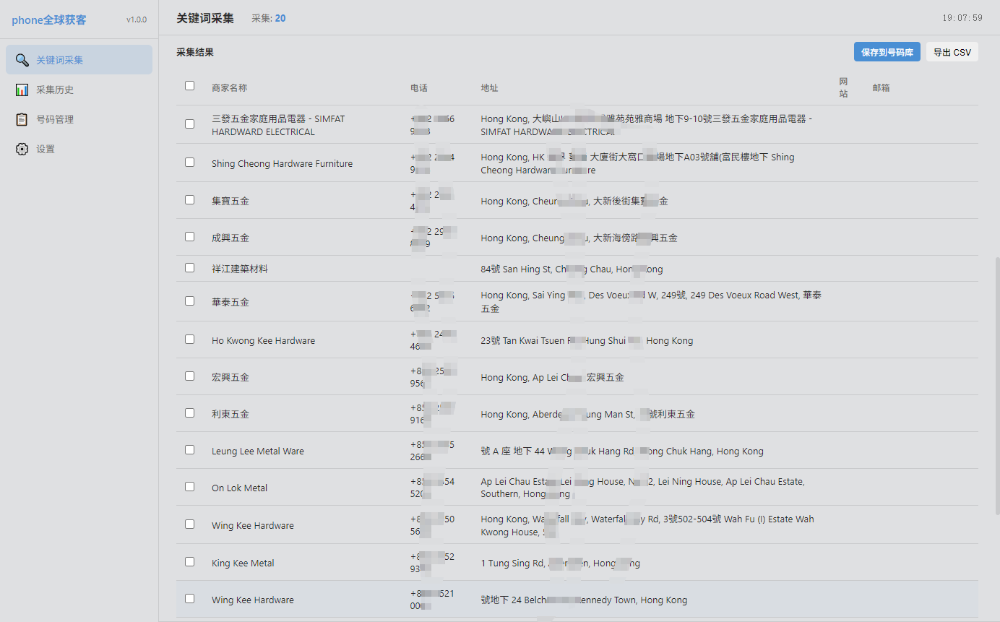

# phone全球获客

[English](README_EN.md) | 简体中文

[](LICENSE)

`phone全球获客` 是一款以全球商业线索采集为核心的桌面工具，面向外贸、跨境服务、本地生活、B2B 销售和渠道拓展场景。通过关键词、地区、语言和筛选条件组合，可以快速采集全球商家信息，获取座机、手机号、地址、网站、邮箱等线索，并沉淀到号码库中，方便后续筛选、整理和导出。

## 核心能力

- 全球关键词获客：支持按行业关键词和目标地区采集潜在客户。
- 多语言地区搜索：支持 English、中文、Español、Français、Deutsch、العربية、Português、日本語、한국어 等语言配置。
- 商家信息采集：可获取商家名称、座机、手机号、地址、网站、邮箱等线索字段。
- 精准筛选：支持标题匹配、最低评分、网站筛选、仅搜索手机号等过滤条件。
- 社交与详情扩展：可按需采集 Facebook、Instagram、YouTube、TikTok、LinkedIn、网页搜索、详细信息、评论等数据。
- 座机与手机号沉淀：采集结果可保存到号码库，支持搜索、筛选、导入、删除和导出 CSV。
- 采集历史：可查看历史采集任务，追踪采集状态并回看结果。

## 产品截图

### 关键词采集

| 关键词采集 |
| --- |
|  |

### 采集结果

| 采集结果 |
| --- |
|  |

## 适用场景

- 外贸客户开发
- 跨境业务找商家
- 本地服务商线索采集
- B2B 电话与邮箱线索整理
- 区域市场调研
- 行业名单批量沉淀

## 功能亮点

- 按国家、城市、区域搜索目标客户。
- 按行业关键词批量发现潜在商家。
- 同时覆盖座机号码和手机号线索。
- 支持只保留手机号，便于做更精准的私域触达。
- 支持采集网站和邮箱，方便多渠道跟进。
- 支持社交主页采集，辅助判断客户活跃度。
- 支持保存到号码库，统一管理全球客户线索。
- 支持导出 CSV，方便交给销售团队、客服团队或 CRM 系统继续处理。

## 部署与运行

### 环境要求

- Node.js 18+
- npm
- Windows 桌面环境

### 安装依赖

```bash
npm install
```

### 开发环境运行

```bash
npm run dev
```

运行后会自动启动本地 Vite 服务，并拉起 Electron 桌面窗口。

### 打包 Windows 桌面版

```bash
npm run build
```

打包产物默认输出到 `dist/` 目录。

如果 Windows 环境在解压签名工具时遇到符号链接权限问题，可以先用目录包方式验证：

```bash
npx electron-builder --dir --config.win.signAndEditExecutable=false
```

该命令会生成可直接测试的 `dist/win-unpacked/` 目录包。

## 商业授权与合规声明

- 商用、商业集成、二次封装、SaaS 集成、代部署或面向客户交付前，必须联系作者获得明确授权。
- 使用本工具采集数据时，请遵守目标网站的 robots.txt、服务条款、接口规则和访问频率限制。
- 请遵守各个国家和地区关于网络爬虫、数据采集、隐私保护、个人信息保护、反垃圾信息和商业触达的法律法规。
- 使用者需自行确认采集、存储、导出和使用线索数据的合法性，禁止用于垃圾营销、骚扰、欺诈或其他违法用途。

## 联系方式

扫码添加微信，了解定制和使用支持。


